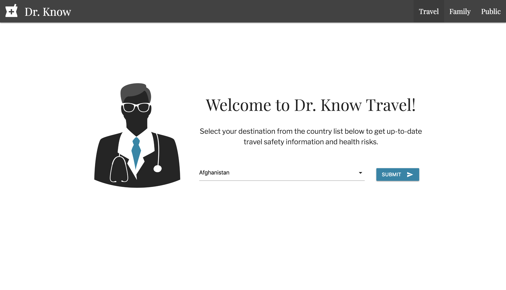
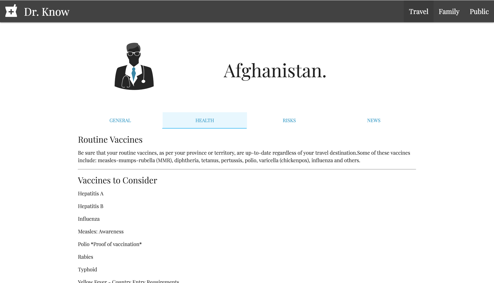

My group project incorporating Github collaboration , API's, Ajax, JQuery and Materialize to develop a fully functioning website that offers travel health and wellbeing information, hilighting suggested and required vaccinations.

Try it out here: https://pritch13.github.io/Project1BC/

